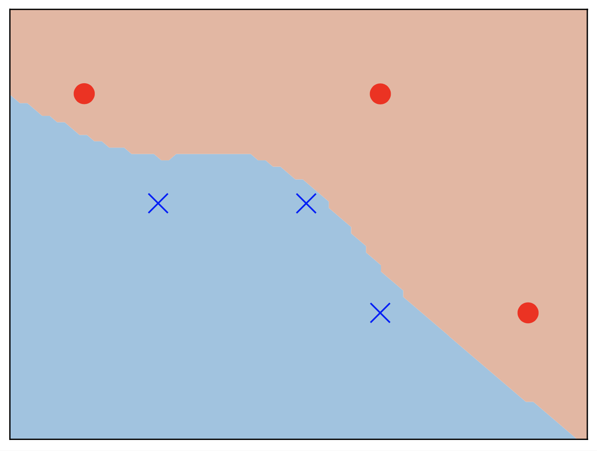
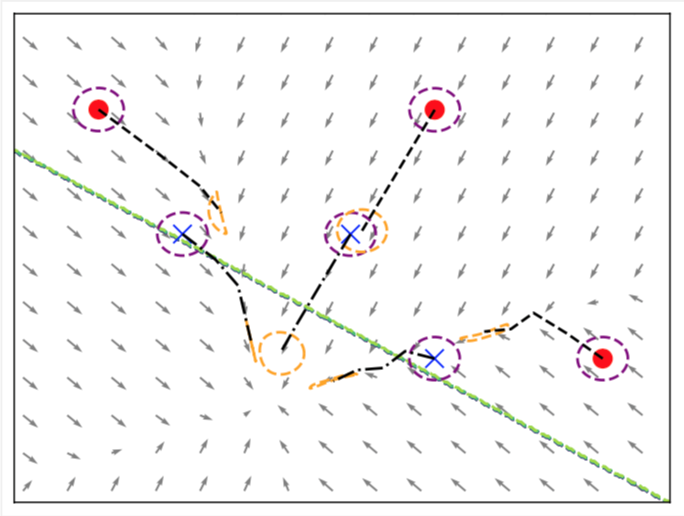
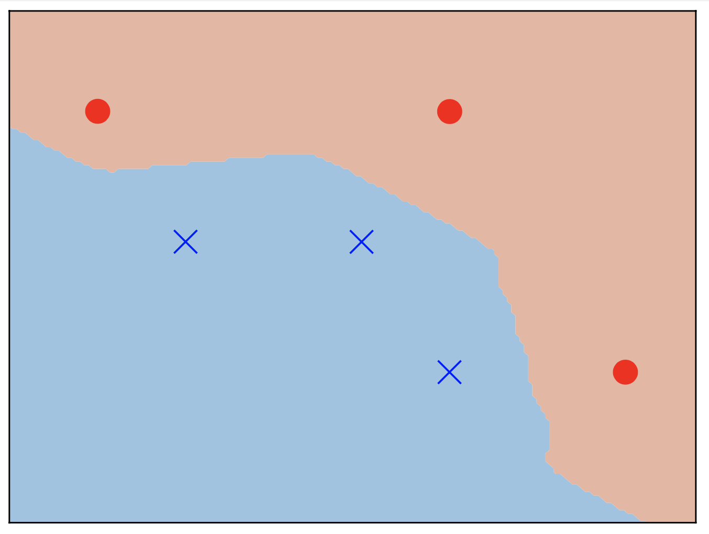
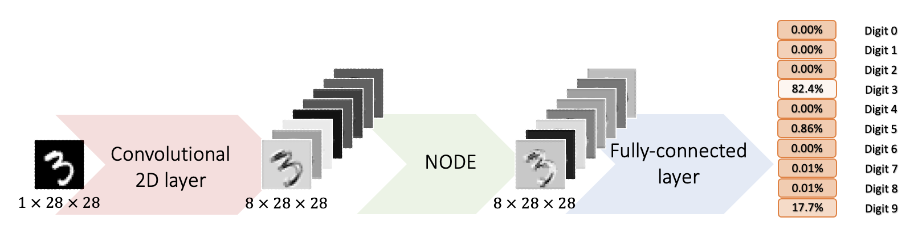
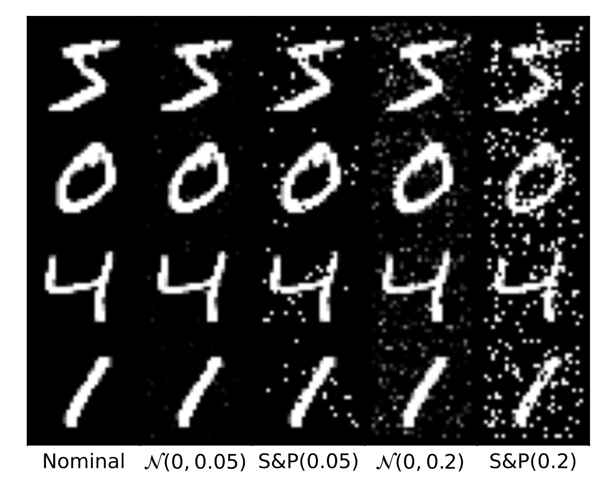
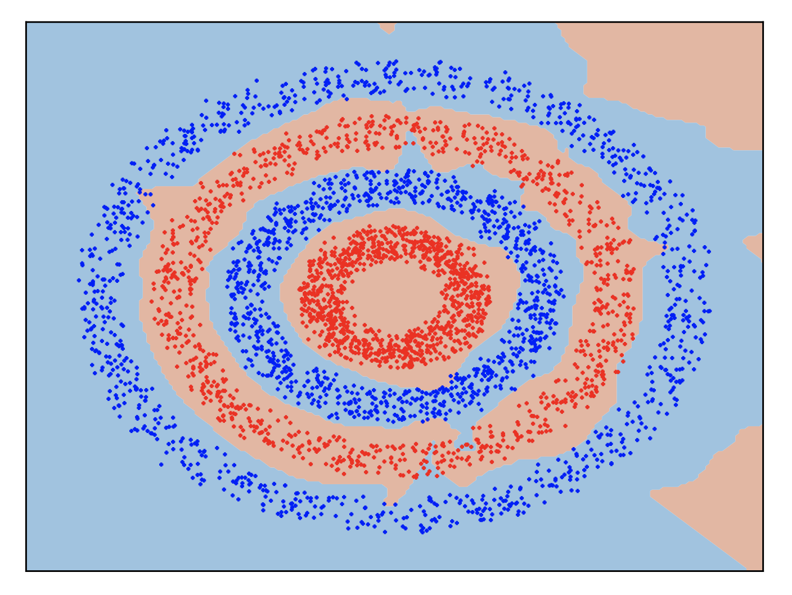
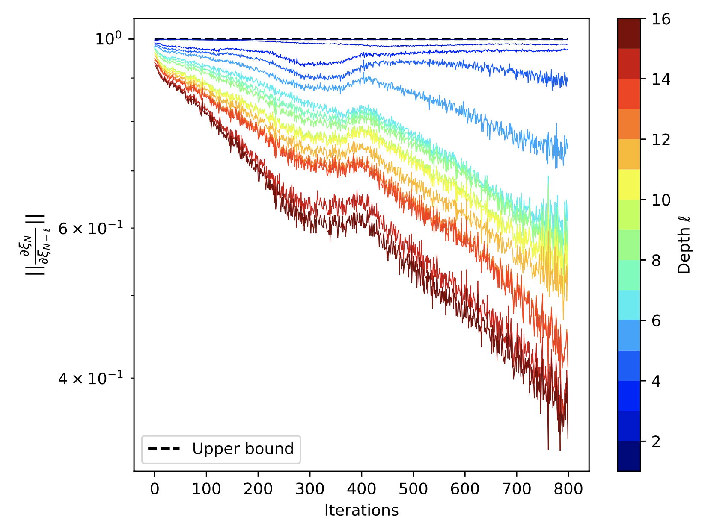

# Contractive-Hamiltonian-Neural-ODEs
PyTorch implementation of our paper "On Robust Classification using Contractive Hamiltonian Neural ODEs"

## Installation 

The code requires the following packages: 

1) torch
2) pytorch_lightning
3) numpy
4) matplotlib
5) scipy
6) skimage

## Illustration 1
To show how contractivity promotes the robustness of a neual ODE, a comparison between a vanilla neural ODE  and a contractive Hamiltonian Neural ODE (CH-NODE) is provided. We can see that classifier for a vanilla ODE has less margins (top-left) as compared to a CH-NODE (bottom-left). Moreover, from the perturbation analysis, for the vanilla ODE (top-right), we can see that a small ball (purple ball) around a nominal train poits maps to sets (organge ellipsoids) that may cross the decision hyperplane and this mis-classify. On the other hand, for the CH-NODE, the orange sets remain on the one side of the hyperplabe (bottom-right). This explains that, indeed, contractive Neural ODEs are more robust than vanilla ODEs. The dynamics of vanilla NODE are given as 

  

## Illustration 2
We provide the comparison of CH-NODE with residual networks (ResNets) and Hamiltonian deep neural networks (H-DNNs). We employed the following architecture

where the convolution layer maps from 1 to 8 channels and has a filter of size (3 x 3). Both the stride and the padding are set to 1 in the experiments. The output layer is chosen as softmax.

We used zero-mean White Gaussian and Salt and Pepper noise to corrupt 10,000 test images. Few images are shown below for the reference. 
We use the complete MNIST dataset (60,000 training samples and 10,000 test samples), a mini-batch size of 100, and 10 epochs for the training. For the optimization algorithm, we use SGD with Adam [1] and the cross-entropy loss. The learning rate, or optimization step size, is initialized to be 0.04 with a decay rate of 0.8 at each epoch.  

## Illustration 3
We demonstrate that our proposed CH-NODE enjoys non-exploding gradients properties by design. The left figure shows the classification result for the double-circles dataset. The red and blue regions show the prediction of the classifier.  The right figure exhibits the 2-norm of the backward sensitivity matrix (BSM). 

  

### References

[1] Kingma, D.P. and Ba, J., 2014. Adam: A method for stochastic optimization. arXiv preprint arXiv:1412.6980.
