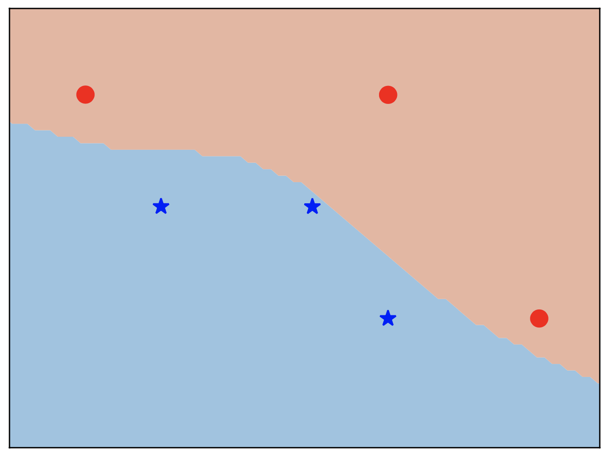
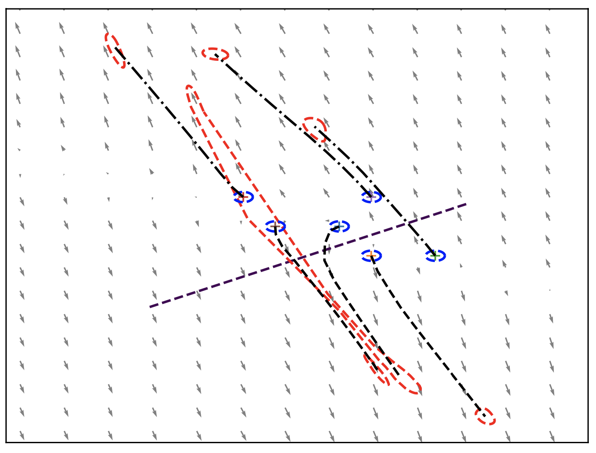
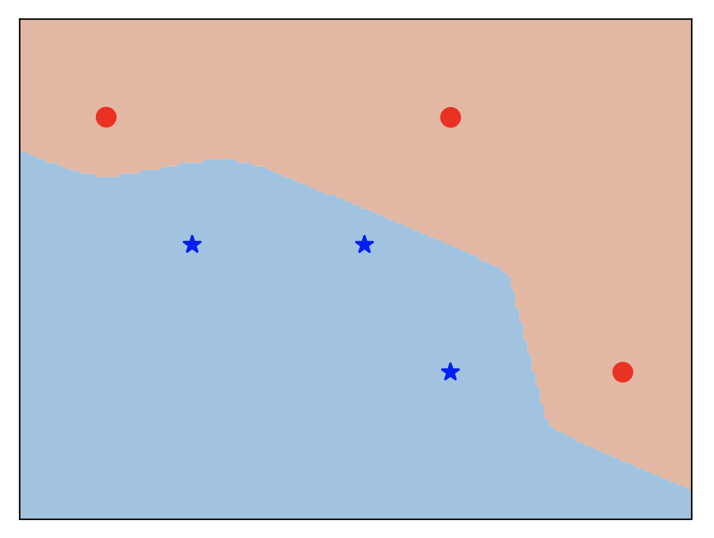
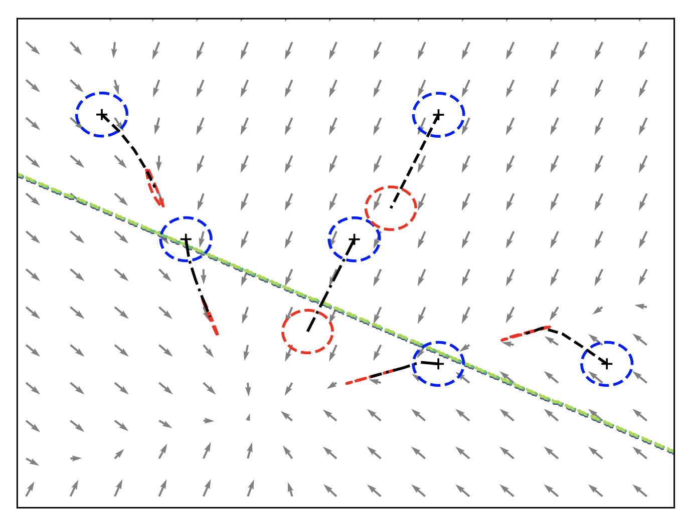

# Contractive-Neural-ODEs
PyTorch implementation of Contractive Hamiltonian Neural ODEs

## Installation 

## Illustration 1
To show how contractivity promotes the robustness of a neual ODE, a comparison between a vanilla neural ODE  and a contractive Hamiltonian Neural ODE (CH-NODE) is provided.

Contractive_neural_ODE_flow
## Illustration 2
We provide the comparison of CH-NODE with ResNets and H-DNNs. 

## Illustration 3
We demonstrate that our proposed CH-NODE enjoys non-exploding gradients properties by design. 

  

